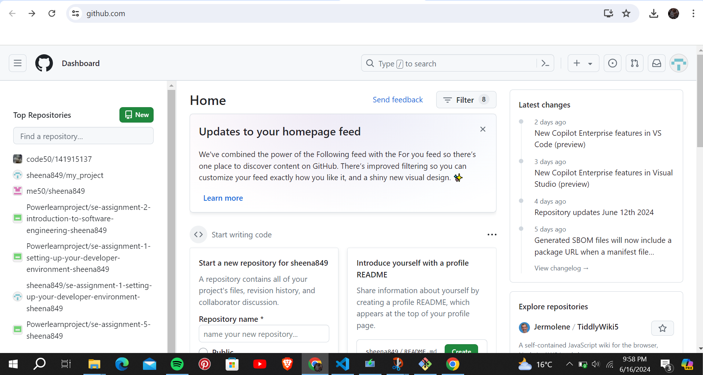

# Dev_Setup
Setup Development Environment

#Assignment: Setting Up Your Developer Environment

#Objective:
This assignment aims to familiarize you with the tools and configurations necessary to set up an efficient developer environment for software engineering projects. Completing this assignment will give you the skills required to set up a robust and productive workspace conducive to coding, debugging, version control, and collaboration.

#Tasks:

1. Select Your Operating System (OS):
   Choose an operating system that best suits your preferences and project requirements. Download and Install Windows 11. https://www.microsoft.com/software-download/windows11
         1) Download windows 11 
   Visit the microsoft Website .Choose windows 11:Download and install from the Microsoft Windows 11 download page.
   Download the installer and follow the on screen instructions to install Windows 11 
   My windows doesnot support windows 11.

2. Install a Text Editor or Integrated Development Environment (IDE):
   Select and install a text editor or IDE suitable for your programming languages and workflow. Download and Install Visual Studio Code. https://code.visualstudio.com/Download
   Download Visual studio code
Via the link provide 
Choose the version suitable for your operating system windows!
Click on the appropriate installer link to download the setup file. (after the vs code is download ) 
Once downloaded, run the installer and follow the on-screen instructions to complete the installation.
3. Set Up Version Control System:
   Install Git and configure it on your local machine. Create a GitHub account for hosting your repositories. Initialize a Git repository for your project and make your first commit. https://github.com
     STEP 1: Install Git
Download Git:
Visit the Git download page.
Choose your operating system (Windows) and download the installer.(Git is already downloaded).
            Install Git:
Run the downloaded installer and follow the setup instructions.
Confirm the installation by running git --version in your command prompt or terminal.
          STEP 2:Configure Git
Open Command Prompt or Terminal.
Set your username and email:
          STEP 3:Create a GitHub Account
Visit the GitHub website.
Sign up for a new account by providing the required information.
.       STEP 4 :Initialize a Git Repository and Make Your First Commit
Navigate to your project directory, Initialize a new Git repository,Add the project files to the staging area and Make your first commit 

4. Install Necessary Programming Languages and Runtimes:
  Instal Python from http://wwww.python.org programming language required for your project and install their respective compilers, interpreters, or runtimes. Ensure you have the necessary tools to build and execute your code.
          STEP 1 :Install Python
Go to the Python download page.
Download the latest stable release suitable for your operating system (Windows).
          STEP 2 : Verify Installation
Open  Terminal.
Check the Python version:
       STEP 3 : Configure Environment 
Set up virtual environments to manage dependencies:
5. Install Package Managers:
   If applicable, install package managers like pip (Python).

6. Configure a Database (MySQL):
   Download and install MySQL database. https://dev.mysql.com/downloads/windows/installer/5.7.html
     STEP 1: Download MySQL:
Visit the MySQL download page.
Choose the appropriate installer for your system. The "mysql-installer-community" 
     STEP 2 :Install MySQL:
Run the downloaded installer.
Follow the installation wizard steps, selecting the desired configuration 
Set up the MySQL server configuration (root password, user accounts).
      STEP 3:Verify Installation:
Open the MySQL Command Line Client.
Log in with the root password you set during installation.

7. Set Up Development Environments and Virtualization (Optional):
   Consider using virtualization tools like Docker or virtual machines to isolate project dependencies and ensure consistent environments across different machines.

8. Explore Extensions and Plugins:
   Explore available extensions, plugins, and add-ons for your chosen text editor or IDE to enhance functionality, such as syntax highlighting, linting, code formatting, and version control integration
   STEP 1 :Open Visual Studio Code.
Go to the Extensions view by clicking the Extensions icon in the Activity Bar .
Search for and install the desired extensions.,

9. Document Your Setup:
    Create a comprehensive document outlining the steps you've taken to set up your developer environment. Include any configurations, customizations, or troubleshooting steps encountered during the process. 
Troubleshooting
Python Virtual Environment Activation:
Ensure the command is correct (myenv\Scripts\activate for Windows).
MySQL Installation Issues:
Verify installation path and MySQL service status.
#Deliverables:
- Document detailing the setup process with step-by-step instructions and screenshots where necessary.
- A GitHub repository containing a sample project initialized with Git and any necessary configuration files (e.g., .gitignore).
- A reflection on the challenges faced during setup and strategies employed to overcome them.

#Submission:
Submit your document and GitHub repository link through the designated platform or email to the instructor by the specified deadline.

#Evaluation Criteria:**
- Completeness and accuracy of setup documentation.
- Effectiveness of version control implementation.
- Appropriateness of tools selected for the project requirements.
- Clarity of reflection on challenges and solutions encountered.
- Adherence to submission guidelines and deadlines.

Note: Feel free to reach out for clarification or assistance with any aspect of the assignment.
